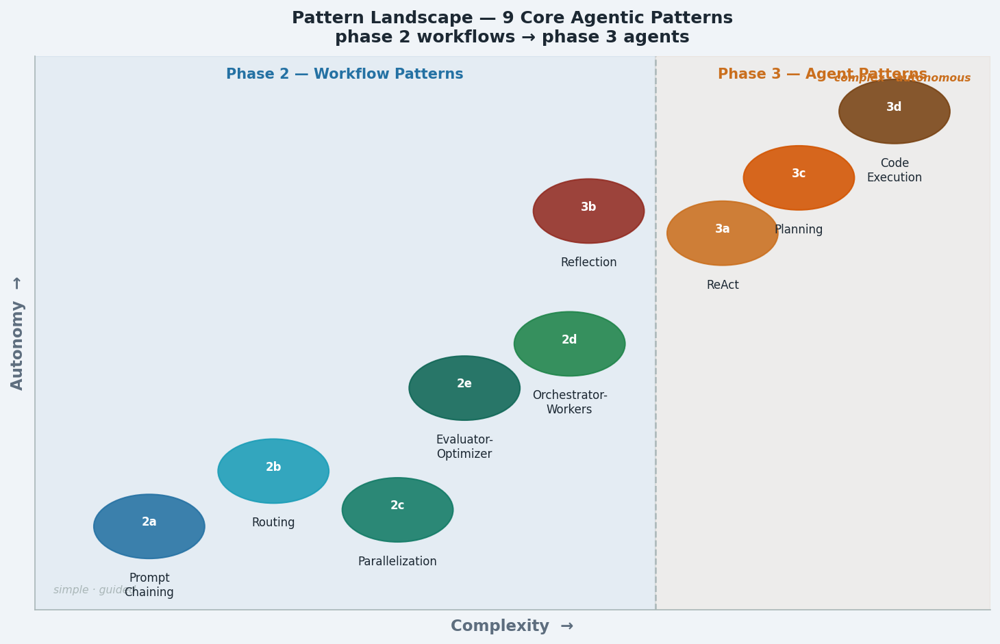
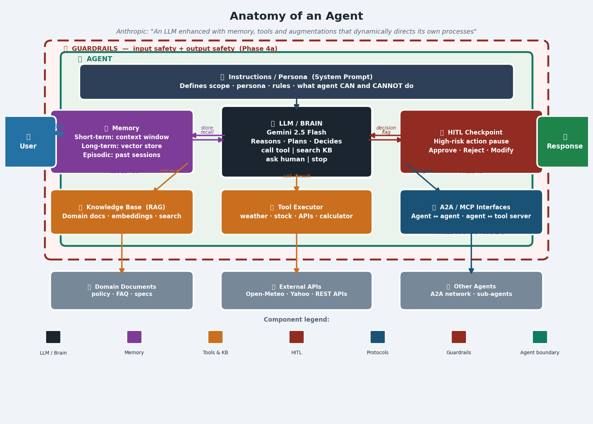

# Architecture — Agentic AI Cookbook (_agents101)

> Progressive-disclosure architecture doc (wshobson/agents pattern).  
> Read this file first. Deep-dive detail lives in `docs/DECISIONS.md` and `docs/patterns.md`.

---

## Overview

`_agents101` is a hands-on, self-paced agentic AI learning curriculum implemented as a
Streamlit multi-page application. Each page in the app is a live, interactive demo of one
architectural pattern — learners build understanding by running real agents, not reading slides.



---

## System Diagram

```
┌─────────────────────────────────────────────────────────────────┐
│  Streamlit Multi-Page App  (app.py → pages/)                   │
│                                                                 │
│  Phase 0  Phase 1  Phase 2  Phase 3  Phase 4 … Phase 9         │
│  Setup    Aug.LLM  Workflows Agents  Safety      Best Practices │
└───────────────────────────┬─────────────────────────────────────┘
                            │
              ┌─────────────▼──────────────┐
              │      utils/                │
              │  llm.py    ← Gemini SDK    │
              │  tools.py  ← 6 real tools  │
              │  diagrams.py ← matplotlib  │
              │  quiz.py   ← MCQ engine    │
              └─────────────┬──────────────┘
                            │
              ┌─────────────▼──────────────┐
              │  Google Gemini 2.5 Flash   │
              │  (google-genai SDK)        │
              │  GEMINI_API_KEY in .env    │
              └────────────────────────────┘
```

---

## Technology Stack

| Layer | Technology | Why |
|---|---|---|
| **LLM** | Google Gemini 2.5 Flash | Free tier, function calling, JSON mode, 2.5+ required |
| **SDK** | `google-genai` (NOT `google-generativeai`) | Current non-deprecated SDK |
| **UI** | Streamlit multi-page | Zero-boilerplate interactive Python UI |
| **Diagrams** | matplotlib → PNG → `st.image()` | No JS dependencies; diagrams are pure Python |
| **Tools** | Open-Meteo, yfinance, REST Countries, Nager, Official Joke API | All free, no API key |
| **Embeddings** | `gemini-embedding-001` (3072-dim) | Current model; `text-embedding-004` is deprecated |
| **Vector store** | ChromaDB (Phase 5b) | Local, no server required |
| **Retry** | `tenacity` exponential back-off | Handles Gemini 503s automatically |
| **Env** | `python-dotenv` + `.env` | `.env` is gitignored; `.env.example` is committed |

---

## Learning Phases



| Phase | Title | Pages | Status |
|---|---|---|---|
| 0 | Foundations | Hello Gemini, Agent Anatomy, Learning Insights | ✅ Complete |
| 1 | Augmented LLM | Plain LLM → Memory → Tools → Mini Agent | ✅ Complete |
| 2 | Workflow Patterns | Chaining, Routing, Parallelization, Orchestrator, Evaluator | ✅ Complete |
| 3 | Core Agent Patterns | ReAct, Reflection, Planning, Code Exec, Pattern Guide | ✅ Complete |
| 4 | Trust & Safety | Guardrails, HITL, LLM-as-Judge, Eval Framework | ✅ Complete |
| 5 | Knowledge & Memory | RAG Agent, Long-term Memory | ✅ Complete |
| 6 | Multi-Agent & Protocols | Multi-Agent, MCP, A2A, Agent Comms | ✅ Complete |
| 7 | Production Operations | Observability, Cost & Latency, Error Analysis | ✅ Complete |
| 8 | Agents in Practice | Customer Support Agent, Elite Multi-Agent | ✅ Complete |
| 9 | Best Practices | Tool Design, Prompt Engineering, When NOT to use agents | ✅ Complete |
| 10 | Frameworks Layer | LangGraph, LangChain, Google ADK | 🔜 Planned |
| 11 | Managed Platforms | Vertex AI, Azure, Bedrock, OpenAI | 🔜 Planned |

---

## Key Design Principles

### 1. API-First, Frameworks Last

Learners implement every pattern directly against the Gemini SDK before touching LangGraph or
LangChain. Anthropic's engineering team explicitly recommends this sequence: framework
abstractions hide what is happening, and developers who start with frameworks cannot debug them.
Someone who built agents from scratch reads LangGraph source code and understands it immediately.
The reverse (framework-first → first principles) is much harder.

See [ADR-002](DECISIONS.md#adr-002-frameworks-come-last) for the full decision record.

### 2. Every Interactive Page Shows Its Work

Every page that calls an LLM includes a `🔬 Execution Trace` expander showing:
- Exact system prompt sent
- Exact user message sent
- Raw LLM response before any parsing
- Scoring/threshold decisions (for judge and evaluator pages)

This is the primary learning mechanism — learners see exactly what went in and came out.

### 3. Automatic Function Calling Is Always Disabled

The Gemini SDK auto-executes tools silently by default. Every page that uses tools sets:
```python
automatic_function_calling=types.AutomaticFunctionCallingConfig(disable=True)
```
Without this, tool calls are invisible and `response.function_calls` returns `None`.

### 4. Real Tools, Not Mocks

All 6 tools call live public APIs. No mocking. Learners see real weather, real stock prices,
real country data. This makes the tool-calling demos credible and unpredictable enough to be
interesting.

### 5. Comparison Standard — Tables, Never Bullet Lists

Every comparison in the course (pros/cons, trade-offs, pattern differences) is rendered as a
Markdown table with numbered rows so items align side-by-side. Bullet lists scatter related
information and make asymmetric comparisons unreadable.

---

## File Structure

```
_agents101/
├── app.py                    # Streamlit entry point — navigation definition
├── pages/
│   ├── 00a_Home.py           # Dashboard with phase progress
│   ├── 00_Hello_Gemini.py    # Phase 0: API verification
│   ├── 00c_Agent_Anatomy.py  # Phase 0: component breakdown
│   ├── 01_Phase1_...         # Phase 1: 4 tabs (Plain LLM → Mini Agent)
│   ├── 02a–02e_*.py          # Phase 2: 5 workflow pattern pages
│   ├── 03_Agents.py          # Phase 3a: ReAct
│   ├── 03f_Reflection.py     # Phase 3b: Reflection
│   ├── 03f2_Planning.py      # Phase 3c: Planning
│   ├── 03g2_CodeExec.py      # Phase 3d: Code Execution
│   ├── 03p_PatternCompare.py # Phase 3e: Decision Guide
│   ├── 03b–03o_*.py          # Phases 4–8: Safety, Memory, Multi-Agent, Ops
│   ├── 04a_Customer_Support  # Phase 8a: Full production pipeline
│   ├── 0q_Quiz_Hub.py        # Dynamic MCQ quiz for all phases
│   └── 05_Best_Practices.py  # Phase 9: Tool design + prompt engineering
├── utils/
│   ├── llm.py                # Gemini wrapper (model, retry, chat helpers)
│   ├── tools.py              # 6 real tools (weather, stocks, units, country, holidays, joke)
│   ├── diagrams.py           # matplotlib diagram functions → PNG bytes
│   └── quiz.py               # Phase seeds + Gemini MCQ generator
├── docs/
│   ├── ARCHITECTURE.md       # This file
│   ├── DECISIONS.md          # Architecture Decision Records (ADRs)
│   ├── patterns.md           # All 9 agent patterns reference
│   └── images/               # Exported architecture PNGs
├── AGENTS.md                 # Canonical 150-line project index
├── CLAUDE.md                 # Full project instructions for Claude Code
├── requirements.txt          # Python dependencies
└── .env.example              # Template — copy to .env, add GEMINI_API_KEY
```

---

## Running Locally

```bash
cd c:\Users\abc\devtools\_agents101
uv pip install -r requirements.txt   # use uv, not pip
copy .env.example .env               # add your GEMINI_API_KEY
.venv\Scripts\python.exe -m streamlit run app.py
```

Open http://localhost:8501

---

*Pattern: wshobson/agents — progressive disclosure, canonical index in AGENTS.md, detail in docs/*
