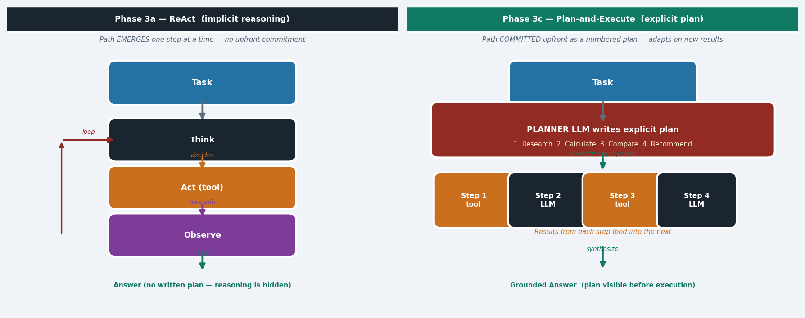

# Agentic AI Patterns Reference

All 9 patterns implemented in this course. Phase 2 = workflow (you control the flow).
Phase 3 = agent (the LLM controls the loop).

---

## Phase 2 — Workflow Patterns

### 2a — Prompt Chaining

**Mechanism:** Output of step N becomes the input of step N+1. The developer defines every step
in advance.

**Page:** `pages/02a_Prompt_Chaining.py`

**When to use:**
- Steps are fixed and sequential
- Each step's output is well-defined
- No live data or tool calls needed

**LLM calls:** Equal to number of steps (usually 2–4). Low cost.

**Real example:** Blog post pipeline — brief → outline → draft → SEO optimise → publish-ready post.

**Key risk:** Error propagation. A hallucination in step 1 corrupts all downstream steps silently.

---

### 2b — Routing

**Mechanism:** Classify the input first, then dispatch to a specialised handler for that category.

**Page:** `pages/02b_Routing.py`

**When to use:**
- Multiple distinct input types require different expertise or prompts
- A general handler would give mediocre results on all categories

**LLM calls:** 1 classifier + 1 handler = 2. Low cost.

**Real example:** Customer support — billing query → billing agent, bug report → tech agent,
general question → FAQ lookup.

**Key risk:** Misclassification sends the query to the wrong specialist, producing a confident
but wrong answer.

---

### 2c — Parallelization

**Mechanism:** Fan-out to N independent workers, then aggregate or vote on their outputs.

**Page:** `pages/02c_Parallelization.py`

**When to use:**
- Subtasks are independent (no dependencies between them)
- Consensus improves quality (majority vote)
- Latency matters and subtasks can run concurrently

**LLM calls:** N parallel workers + 1 aggregator. Medium cost.

**Real example:** Security code review — 3 independent LLMs scan the same codebase for
vulnerabilities, majority vote determines which findings are reported.

**Key risk:** Aggregation logic is hard. Contradictory results need a tiebreaker rule.

---

### 2d — Orchestrator-Workers

**Mechanism:** An orchestrator LLM dynamically creates a plan and delegates subtasks to
specialised worker agents.

**Page:** `pages/02d_Orchestrator_Workers.py`

**When to use:**
- Task is complex with an unknown subtask structure
- Different subtasks require different specialisations
- Plan needs to adapt based on worker results

**LLM calls:** 1 orchestrator + N worker calls. Medium-High cost.

**Real example:** Research report — orchestrator delegates web search, data analysis, and
writing to specialist agents, then assembles the final report.

**Key risk:** Orchestrator can over-delegate or create redundant/conflicting tasks.

---

### 2e — Evaluator-Optimizer

**Mechanism:** Generator produces output → Evaluator scores it → if below threshold, refine
→ repeat until pass or max iterations.

**Page:** `pages/02e_Evaluator_Optimizer.py`

**When to use:**
- Output must meet a measurable quality threshold
- Iterative refinement is expected
- An objective scoring function exists

**LLM calls:** 2 per iteration (generate + evaluate) × N iterations. Medium-High cost.

**Real example:** Code generation — write code → evaluate test results → fix bugs → re-evaluate.

**Key risk:** Evaluator and generator can collude (same model, same biases). Use a separate
evaluator model or a rule-based scorer.

---

## Phase 3 — Core Agent Patterns

### 3a — ReAct

**Mechanism:** Think → Act (call a tool) → Observe the result → repeat until the answer is
ready. The LLM decides when to stop.

**Page:** `pages/03_Agents.py`

**When to use:**
- Open-ended tasks requiring live data
- Number of steps is unknown upfront
- Task requires adaptive reasoning based on real-world results

**LLM calls:** ~2–3 per tool call × N tool calls. High cost. Unbounded.

**Real example:** Travel planner — searches flights, checks weather, looks up visa requirements,
finds hotels iteratively until it has a complete answer.

**Key risk:** Infinite tool loops. No upfront plan means the agent can get lost on complex
multi-step tasks.

---

### 3b — Reflection

**Mechanism:** Generate output → Critique it (self or external reviewer) → Revise based on
critique → repeat until quality threshold or max cycles.

**Page:** `pages/03f_Reflection.py`

**When to use:**
- Output quality is critical
- Objective quality criteria can be checked
- Diminishing-returns are acceptable (2–3 cycles is usually enough)

**LLM calls:** 2 per cycle (generate + critique). High cost.

**Real example:** Legal document drafting — draft contract → critique for compliance gaps →
revise → critique again → final document.

**Key risk:** Self-critique hallucination — the LLM can invent flaws that don't exist or miss
real ones. Use a separate critique model when quality is critical.

---

### 3c — Planning (Plan-and-Execute)

**Mechanism:** Write an explicit numbered plan before touching any tool. Execute each step in
sequence with full context. Synthesise the final answer from all step results.

**Page:** `pages/03f2_Planning.py`

**When to use:**
- Multi-step tasks with predictable structure
- Explainability is required (stakeholders need to read the plan)
- Task has a clear goal that can be decomposed upfront

**LLM calls:** 1 planner + N executors + 1 synthesiser. High cost.

**Real example:** Competitive analysis — plan: research competitor A, research competitor B,
compare on 5 dimensions, recommend action — then execute each step.

**Key risk:** Rigid plan. If step 2 reveals unexpected information, the remaining steps may
be wrong. Use Adaptive Planning (Tab B in the page) when mid-run surprises are likely.

---

### 3d — Code Execution

**Mechanism:** LLM writes Python code → sandbox executes it → LLM observes stdout/errors →
decides to fix or accept.

**Page:** `pages/03g2_CodeExec.py`

**When to use:**
- Computations, statistics, data transformations requiring deterministic precision
- The answer is a number or structured data, not prose
- You need verifiable, reproducible results

**LLM calls:** Generate + debug loops. High cost.

**Real example:** Data analysis — write pandas transforms → run → fix type errors → run again →
extract insights from the output.

**Key risk:** Generated code with side effects (network calls, file writes, `os.system()`).
**Always sandbox.** Never exec untrusted LLM code directly in production.

---

## Pattern Selection Guide

See [Phase 3e — Pattern Decision Guide](../pages/03p_PatternCompare.py) for the interactive
advisor, or use this quick reference:

| Question | → Pattern |
|---|---|
| Can I write down all the steps upfront? | Prompt Chaining or Planning |
| Are the inputs different types needing different expertise? | Routing |
| Can I break it into fully independent subtasks? | Parallelization |
| Do I need iterative quality improvement with scoring? | Evaluator-Optimizer |
| Do subtasks need different specialists, dynamic planning? | Orchestrator-Workers |
| Does it need live data and I don't know how many steps? | ReAct |
| Is output quality critical and can I score it? | Reflection |
| Do I need deterministic computation? | Code Execution |

**Rule:** Start with the simplest pattern that works. Add complexity only when simpler patterns fail.
